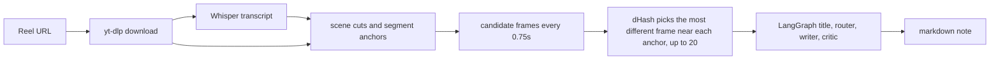
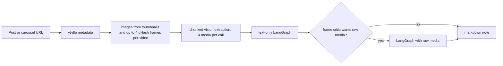
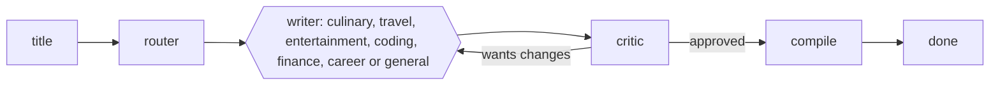
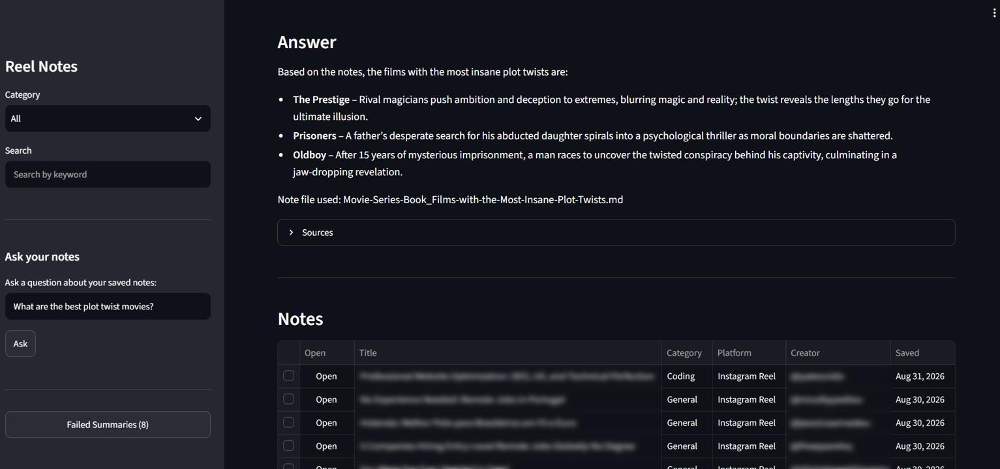
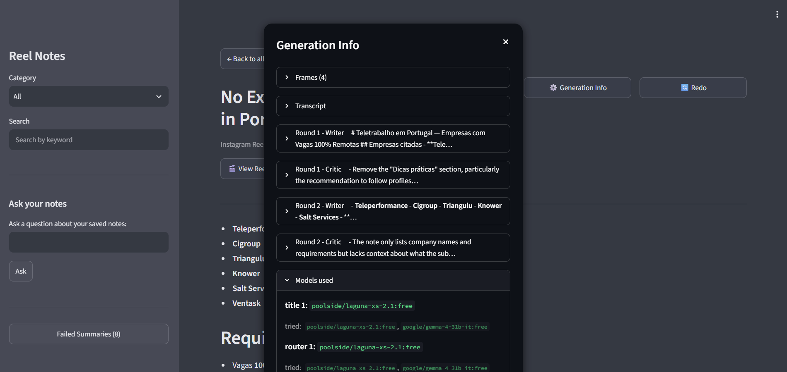

# AI Personal Assistant

A Telegram bot that turns Instagram Reels, posts, and carousels into structured notes. Send it a link and a few minutes later a clean markdown note lands in the notes dashboard. Currently that is all it can do but I am working on turning it into an actual multifunctional personal assistant.

I used to save a lot of reels and never look at them again. So I built this personal assistant that saves all as notes for me. Each reel becomes a short note I can search later, instead of another line in my likes or saved posts. It is a personal tool, not a product, and it runs for my own accounts on my Modal workspace. You can easily deploy the same setup for yourself.

## How it works

Reels:



Posts and carousels:



For a reel, the video is downloaded, the audio is transcribed with Whisper, and frames are pulled from transcript anchors and scene cuts. dHash keeps the frame that changed most near each anchor, so on-screen posters and code snippets survive the cut, and the run stops at 20 frames.

Posts and carousels skip transcription. Images come from thumbnails, each carousel video contributes up to 4 dHash frames, and one vision pass extracts visible text and subjects. The writer starts text only, and a critic sends it back to the raw media only when the note is missing something visible.

Then the LangGraph takes over.

## The agent graph

The graph is small on purpose: a title node names the note, a router picks a category, a writer drafts the note, and a critic reviews it.



LangChain provides the model clients. Every node calls its chain of candidate models one after the other, so a slow or dead provider does not kill the pipeline. `MAX_REVISIONS = 2` caps the writer/critic loop, and after two rounds the note is compiled anyway.

The writer and the critic see raw frames in the reel path. In the post path they usually work from the extracted visual text, and only switch to the raw media if the frame critic asks for them. A detail that is only visible on screen still counts as evidence, so the critic only flags claims that match neither the frames nor the transcript.

## Observability

Every LangGraph run is traced to LangSmith: the title, router, writer, critic, and each model attempt in the fallback chain. It runs on environment variables (`LANGCHAIN_TRACING_V2`, `LANGCHAIN_PROJECT`, `LANGSMITH_API_KEY` in the Modal secret), so there is no tracing code in the app to maintain. Tracing is optional: leave those variables empty and it stays off. I use it to see which model served each step and to read the full prompt and response when a note comes out wrong. The Generation Info in each note records the same model choices inside the app.

## Asking your notes

When a note is saved, its body is embedded by a local BGE model and placed in a LanceDB vector store on the same data volume, so all your data stays in one place. The generation info and transcript sections are left out of the index, which keeps retrieval focused on the note itself. `/ask` on Telegram (or the question box in the dashboard) searches that store by cosine similarity, builds the answer only from the retrieved notes, and lists which notes it used. If no note comes close, it says so instead of guessing. The dashboard has a **Reindex notes** button when you want to rebuild the store after a change.

## Models

Each task keeps its own model list in `core/config.py`. Most are free tier on OpenRouter, and every chain ends with a cheap paid fallback so the pipeline still finishes when the free tier is rate limited. The lists are plain and easy to swap when a provider retires one.

Each agent tries its list in order. If every model fails, the Telegram message lists each one and what it returned, so the real situation is clear instead of a single random provider error. The full error is also kept in the Failed section of the dashboard.

## Stack

- Python 3.11+
- Modal for deployment, with a GPU for reel transcription and no GPU for posts
- LangGraph and LangChain for the agent flow
- LanceDB for vector search
- fastembed for local embeddings
- OpenRouter for free models
- OpenAI Whisper for transcription
- yt-dlp and ffmpeg for download and frames
- Pillow for perceptual hashing of frames
- Streamlit for the dashboard
- Telegram Bot API

## Layout

```
modal_agent/
  app.py
  dashboard.py
  core/
    config.py       model lists per task
    state.py        graph state
    graph.py        the agent graph
    llm.py          model clients, retry and fallback handling
    processor.py    download, transcribe, frames, note storage
    rag.py          semantic search over the saved notes
```

## Setup on Modal

You need a Modal account and the CLI.

1. Create the secret:

```
modal secret create personal-assistant-secrets
```

Add `TELEGRAM_BOT_TOKEN`, `OPENROUTER_API_KEY`, and `UI_URL`. Optionally add `LANGCHAIN_TRACING_V2`, `LANGCHAIN_PROJECT`, and `LANGSMITH_API_KEY` for LangSmith tracing.

2. Deploy:

```
cd modal_agent
modal deploy app.py
```

The data volume is created automatically on the first run.

3. Point Telegram at the webhook:

```
curl -F "url=https://<workspace>--personal-assistant-telegram_webhook.modal.run" \
  https://api.telegram.org/bot<token>/setWebhook
```

Send a reel, post, or carousel link to the bot. It replies with "Processing reel in background..." or "Processing post in background..." and then a message with the note title once it is done.

## Usage

- send any public reel, post, or carousel URL to the bot
- `/notes` lists saved notes
- `/find <keyword>` searches their content
- `/ask <question>` asks your notes a question and answers from their content
- `/link` prints the dashboard URL

The dashboard shows the notes with filters and a search box. Each note has a Generation Info popup with the frames, the raw transcript, every writer/critic round, and the models used in each step. Failed notes have a Retry button. Finished notes have a Redo button, which moves the note to the failed list and reprocesses the same link. Redo uses the GPU worker for reels and the CPU worker for posts. The dashboard also has a **Reindex notes** button for the semantic index.

## Roadmap

- **Phase 1 (Completed):** Extract audio from reels, run Whisper transcription, and generate structured notes with an LLM.
- **Phase 2 (Completed):** Add a LangGraph critic-refiner agent loop to evaluate draft notes and enforce structure.
- **Phase 3 (Completed):** Pick reel frames from transcript anchors and scene cuts, then keep the most distinct ones with dHash.
- **Phase 4 (Completed):** Ask your notes questions in plain language. Notes are embedded locally and searched semantically, and answers come only from the retrieved notes, with the sources named.
- **Phase 5 (Completed):** Support Instagram posts and carousels, including carousel videos, with a text-first pipeline and a raw-media fallback.
- **Phase 6 (Future):** Add human-in-the-loop Telegram prompts for fallback routing when rate-limited (retry with paid model or add the post to a queue), and expand support to other platforms, like YouTube and TikTok. 


## Screenshots



Notes table with categories, creators, and saved dates, plus the Reindex notes button. Click Open to read a note.



Generation Info for one note: frames, transcript, writer/critic rounds, and models used.