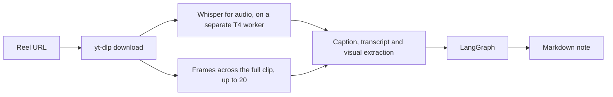
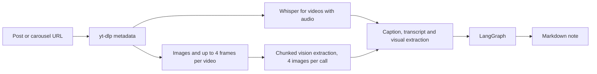
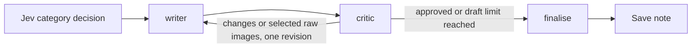
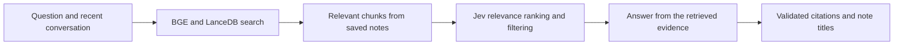

# AI Personal Assistant

A Telegram bot that turns Instagram Reels, posts, and carousels into structured notes. Send it a link and a few minutes later a clean markdown note lands in the notes dashboard. Currently that is all it can do but I am working on turning it into an actual multifunctional personal assistant.

I used to save a lot of reels and never look at them again. So I built this personal assistant that saves all as notes for me. Each reel becomes a short note I can search later, instead of another line in my likes or saved posts. It is a personal tool, not a product, and it runs for my own accounts on my Modal workspace. You can easily deploy the same setup for yourself.

## How it works

Reels:



Posts and carousels:



For a reel, the video is downloaded, its audio is transcribed with Whisper, and frames are pulled from across the full clip. Silent videos skip transcription. The CPU worker handles downloads, frames and model calls; a separate T4 container loads Whisper turbo once and only handles transcription.

Posts and carousels use the same text-first approach. Images come from thumbnails, each carousel video contributes up to 4 frames, and videos with audio are transcribed too. One vision pass extracts visible text and subjects. Successful extraction is cached, so retry and redo can reuse it instead of paying to extract the same media again.

The caption, timestamped transcript and visual extraction stay separate. The writer starts with that text, and the critic asks for selected raw images only when something is unreadable or missing. Incomplete extraction is recorded rather than quietly left out.

Then the LangGraph takes over.

## The agent graph

The graph is small on purpose: Jev picks a category, one writer drafts the note and its title, and a critic reviews it.



The writer uses instructions for culinary, travel, entertainment, coding, finance, career or general notes. LangChain provides the writing and review clients, with one primary model and one paid fallback per task. Calls have deadlines and only temporary failures are retried, so a dead provider does not keep the pipeline waiting indefinitely.

There are at most two drafts. The writer and critic receive the same text evidence, and a detail that is only visible on screen still counts. If review fails or the second draft still needs work, the note is kept with an unverified or needs-review status rather than presented as approved.

## Observability

Generation Info keeps the caption, transcript, visual extraction, writer/critic rounds and model choices with each note. Useful errors stay in the dashboard's owner-only details, while Telegram gets a short explanation of what happened.

LangSmith tracing is still optional through `LANGCHAIN_TRACING_V2`, `LANGCHAIN_PROJECT` and `LANGSMITH_API_KEY` in the Modal secret. Leave those variables empty and it stays off. The app does not need tracing to save notes, show Generation Info or record costs.

## Asking your notes

When a note is saved, its body is embedded by a local BGE model and placed in a LanceDB vector store on the same data volume, so all your data stays in one place. Generation Info and internal cost/error sections are left out of the index, which keeps retrieval focused on the note itself.



`/ask` on Telegram or the dashboard's Chatbot page searches that store by cosine similarity. Jev adds a relevance score for each candidate note, puts stronger matches first and removes low-scoring ones. If Jev is unavailable, the original retrieval still works. There is no fixed limit on the number of notes, but context budgets keep each request bounded.

Answers use the retrieved evidence, and the dashboard puts the actual note titles in a Sources dropdown. If nothing relevant is found, it says so instead of guessing. Chat remembers previous messages in the current browser session, so you can ask follow-up questions. That history helps explain the question; it is not treated as verified evidence.

The starting thresholds are 0.45 maximum cosine distance and 0.65 Jev relevance. They have not been calibrated on my notes yet. `RAG_JEV_ENABLED=false` disables the extra Jev request. The dashboard has a **Reindex notes** button in Settings; rebuilding uses a new table and keeps the working index if the rebuild fails.

## Models

Each task keeps its own model list in `core/config.py`. Most writing and review primaries are free tier on OpenRouter, with a paid fallback when the primary is unavailable. The lists are plain and easy to swap when a provider retires one.

Jev (`typesafe/jev-1.13`) handles category decisions and complementary RAG relevance ranking through OpenRouter's System One API. It does not write notes or answers. Failed category routing falls back to general without another writing-model call. Its initial category confidence threshold is 0.70 and is also an unevaluated starting point.

If processing fails, the attempt is kept in Error/Failed for retry. Provider details stay private; Telegram never gets a stack trace or a list of raw provider errors.

## Costs

Each note version keeps its own extraction, routing, writing and review charges, including retries. The cost appears in the note details, with a **Cost details** expander for individual steps. Cached extraction adds no new API charge, and older versions retain their original costs.

OpenRouter's returned `usage.cost` is used when available. Missing charges are marked unknown, and legacy notes show **Cost not recorded**. Optional Modal resource rates add compute estimates, but GPU cold starts and shared idle time are not fully allocated. The displayed amount is recorded or estimated cost, not a promise of exact billing or savings.

## Stack

- Python 3.11+
- Modal for deployment, with an isolated T4 worker for audio transcription
- LangGraph and LangChain for the agent flow
- LanceDB for vector search
- fastembed for local embeddings
- OpenRouter for writing, review and Jev decisions
- OpenAI Whisper for transcription
- yt-dlp and ffmpeg for download and frames
- Pillow for image resizing
- Streamlit for the dashboard
- Telegram Bot API

## Layout

```text
modal_agent/
  app.py
  dashboard.py
  dashboard_server.py  dashboard server and remembered-device cookies
  core/
    config.py       model lists per task
    state.py        graph state
    graph.py        the agent graph
    llm.py          model clients, retry and fallback handling
    decisions.py    Jev categories and relevance scores
    workflow.py     the processing pipeline
    media.py        downloads, transcription requests and frames
    processor.py    carousel media classification
    storage.py      shared notes, jobs, caches and index operations
    rag.py          semantic search and answers over saved notes
    accounting.py   per-version costs and compute estimates
    requests.py     Telegram input and Instagram URL validation
    telegram.py     messages and reactions
    auth.py         remembered-device credentials
    errors.py       short messages and private error redaction
```

Markdown notes and LanceDB stay on the Modal data volume. One storage function serialises shared changes, while expensive processing happens outside it. Stable source IDs catch duplicate links before any AI call, and job claims prevent an old worker from replacing a newer attempt.

## Setup on Modal

You need a Modal account and the CLI.

1. Create or edit `personal-assistant-secrets` in the Modal dashboard. Add:

| Setting | Value |
|---|---|
| `TELEGRAM_BOT_TOKEN` | Your bot token from BotFather |
| `OPENROUTER_API_KEY` | Your OpenRouter API key |
| `TELEGRAM_ALLOWED_USER_ID` | Your numeric Telegram account ID |
| `TELEGRAM_WEBHOOK_SECRET` | A random secret you generate and also register with Telegram |
| `DASHBOARD_PASSWORD` | A password you choose for your private dashboard |
| `UI_URL` | The deployed dashboard URL |

For a first deployment, use a temporary `UI_URL` such as `https://example.com`, then replace it with the printed `ui` URL and redeploy. Missing required keys block deployment; incoming messages are rejected if webhook security settings are empty.

Optional settings for budgets, media limits, thresholds and compute rates are in [`modal_agent/.env.example`](modal_agent/.env.example). A local `.env` file alone does not populate the named Modal secret. Optionally add `LANGCHAIN_TRACING_V2`, `LANGCHAIN_PROJECT`, and `LANGSMITH_API_KEY` for LangSmith tracing.

2. Deploy:

```text
cd modal_agent
modal deploy app.py
```

The data volume is created automatically on the first run. Whisper weights use a separate cached volume.

3. Point Telegram at the printed `telegram_webhook` URL, passing the same webhook secret:

```bash
curl --request POST \
  --data-urlencode "url=$TELEGRAM_WEBHOOK_URL" \
  --data-urlencode "secret_token=$TELEGRAM_WEBHOOK_SECRET" \
  --data "drop_pending_updates=false" \
  "https://api.telegram.org/bot${TELEGRAM_BOT_TOKEN}/setWebhook"
```

This example uses Bash environment variables; keep the token and secret private. Adding the secret in Modal is not enough: Telegram must send it with each request too. Use the webhook URL, not the dashboard URL.

Send a reel, post, or carousel link to the bot. It reacts to your message while it works, then replies with the saved note title and link. Sending the same source again tells you whether it is already saved, still running or waiting for retry, without another AI call.

## Usage

- send any public reel, post, or carousel URL to the bot, one at a time
- `/notes` lists saved notes
- `/find <keyword>` searches their content
- `/ask <question>` asks your notes a question and answers from their content
- `/link` prints the dashboard URL

The dashboard switches between Notes and Chatbot. The notes table has category filters and search; click a title to open it, or select rows and press Delete. Deletion asks for confirmation. Each note has source/account links, Generation Info and Cost details. Settings contains refresh, reindex and sign out. Dark is the default theme; light is available in Streamlit's theme menu.

Sign in once on each device and choose **Remember this device for 30 days**. The browser keeps a signed cookie, not your password. Signing out clears it, and changing the password invalidates remembered devices. Chat history lasts for the current session, not across new sessions.

Failed notes have a Retry button. Finished notes have a Redo button, which keeps the current note available while its replacement is processed. If redo fails, the current note stays in Notes. If it succeeds, the old content moves to Error/Failed as **Previous version — replaced by redo**, with its original media and costs. A saved note whose indexing failed is kept too, but marked as not searchable yet.

## Testing

Offline tests use temporary storage and fake external services, including Streamlit AppTest. They cover permissions, duplicates, retries, redo, evidence, costs, retrieval, citations and dashboard actions without paid calls or live data.

```text
python -m pytest tests -q
python -m compileall -q modal_agent tests
```

The workflow comparison in `tests/test_payloads.py` checks request and image payloads against the earlier pipeline. Mocked payload reductions do not prove live answer quality or billed savings. After deployment, check one reel, one carousel, a duplicate link, `/ask`, successful/failed redo, costs and login on both desktop and phone. Remote GPU/Volume behaviour and browser layouts still need that manual check.

## Roadmap

- **Phase 1 (Completed):** Extract audio from reels, run Whisper transcription, and generate structured notes with an LLM.
- **Phase 2 (Completed):** Add a LangGraph critic-refiner agent loop to evaluate draft notes and enforce structure.
- **Phase 3 (Completed):** Extract frames across the full clip and keep readable visual evidence for the note.
- **Phase 4 (Completed):** Ask your notes questions in plain language. Notes are embedded locally and searched semantically, and answers come only from the retrieved notes, with the sources named.
- **Phase 5 (Completed):** Support Instagram posts and carousels, including carousel videos, with a text-first pipeline and a raw-media fallback.
- **Phase 6 (Future):** Add human-in-the-loop Telegram prompts for fallback routing when rate-limited (retry with paid model or add the post to a queue), and expand support to other platforms, like YouTube and TikTok. 


## Screenshots

These show an earlier dashboard layout; the current version uses linked titles, a separate Chatbot page and detail expanders.


Notes table with categories, creators, and saved dates, plus the Reindex notes button. The current dashboard opens notes through their titles.


Generation Info for one note: frames, transcript, writer/critic rounds, and models used.
